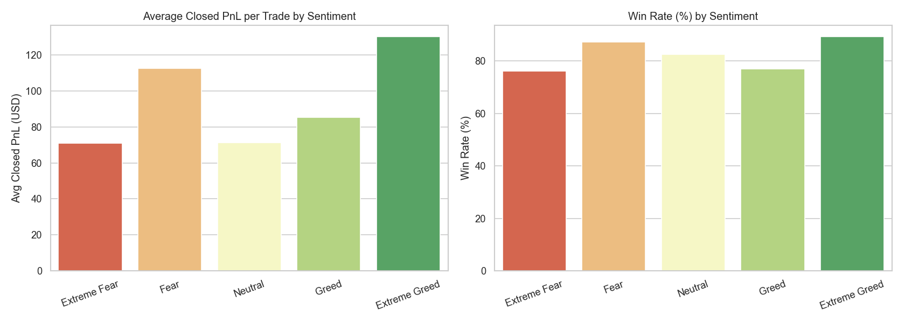
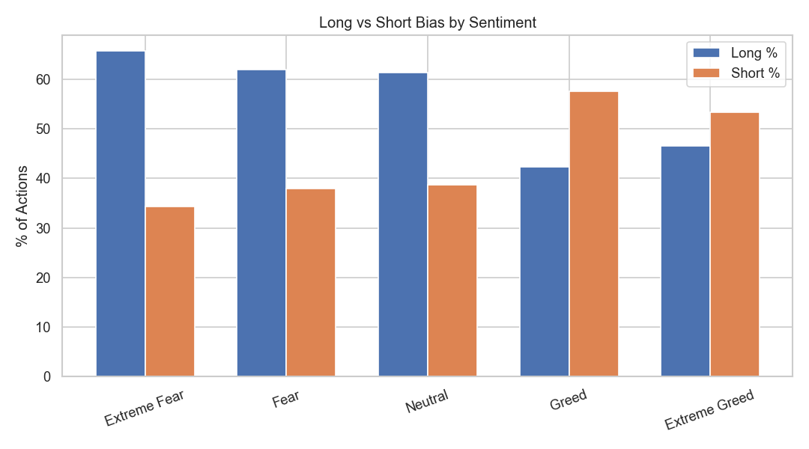
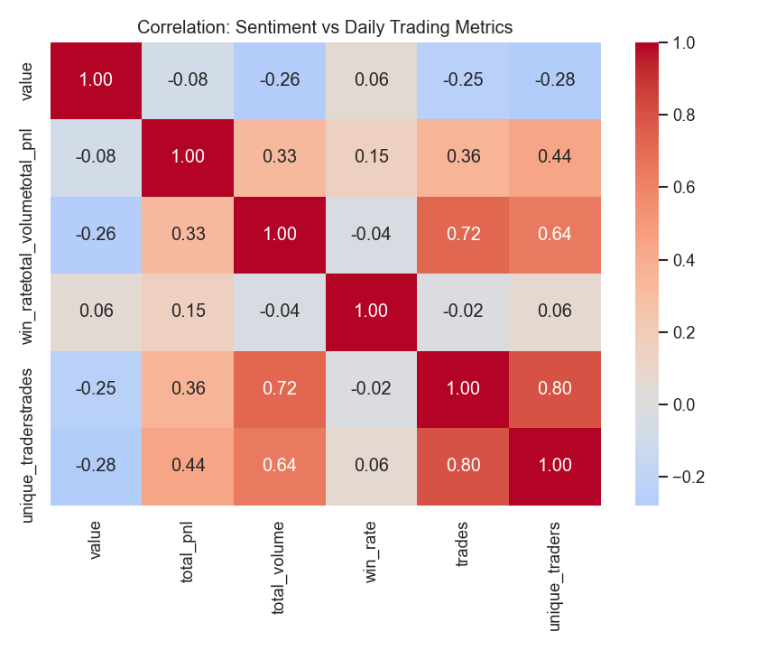
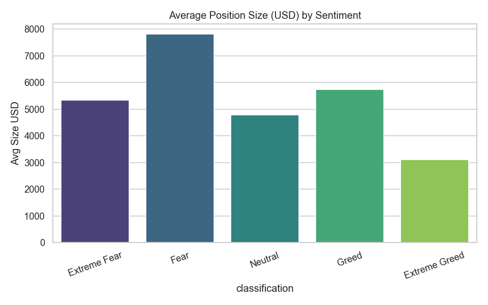
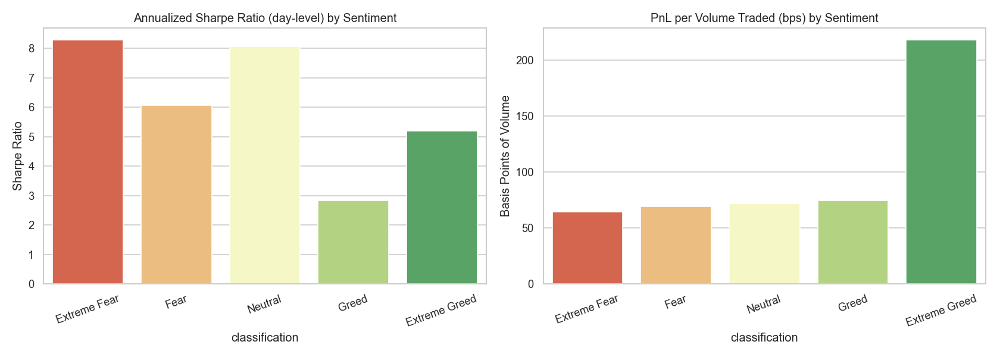
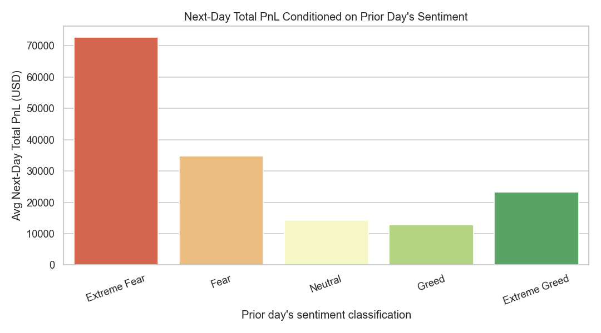

# Trader Performance vs. Bitcoin Market Sentiment

**Analysis of Hyperliquid historical trades against the Fear & Greed Index**

---

## 1. Data & Methodology

| Dataset | Rows | Range | Notes |
|---|---|---|---|
| `fear_greed_index.csv` | 2,644 daily records | 2018-02-01 → 2025-05-02 | `classification` bucketed into Extreme Fear / Fear / Neutral / Greed / Extreme Greed |
| `historical_data.csv` | 211,224 trade fills | 2023-05-01 → 2025-05-01 | 32 unique accounts, 246 coins, includes `Closed PnL`, `Size USD`, `Direction`, `Side`, `Fee` |

**Join:** trades were matched to the sentiment classification for their calendar date (IST). 211,218 of 211,224 trades (100%) matched a sentiment day.

**Key metric definitions:**
- *Closed PnL* — realized profit/loss per fill; only fills with non-zero Closed PnL (104,408 of them) were used for win-rate/avg-PnL statistics (zero-PnL rows are position-opening fills, not closes).
- *Win rate* — % of non-zero-PnL closes that were profitable.
- *Long/short bias* — % of all trade actions (not just closes) tagged as long-side vs. short-side via the `Direction` field.

All code, intermediate CSVs, and charts are in this folder (`analysis.py` + 8 PNGs + supporting CSVs).

---

## 2. Headline Numbers by Sentiment Regime

| Sentiment | Trades | Total PnL | Avg PnL/trade | Win Rate | Total Volume |
|---|---:|---:|---:|---:|---:|
| Extreme Fear | 10,406 | $739,110 | $71.03 | 76.2% | $56.9M |
| Fear | 29,808 | $3,357,155 | $112.63 | **87.3%** | $239.7M |
| Neutral | 18,159 | $1,292,921 | $71.20 | 82.4% | $101.0M |
| Greed | 25,176 | $2,150,129 | $85.40 | 76.9% | $136.9M |
| Extreme Greed | 20,853 | $2,715,171 | **$130.21** | **89.2%** | $57.9M |

---

## 3. Key Findings

### 3.1 Traders are contrarian, not momentum-driven
Position direction flips almost perfectly with sentiment:

| Sentiment | % Long actions | % Short actions | Avg size (USD) |
|---|---:|---:|---:|
| Extreme Fear | 65.7% | 34.3% | $5,350 |
| Fear | 62.0% | 38.0% | $7,816 |
| Neutral | 61.4% | 38.7% | $4,783 |
| Greed | 42.3% | **57.7%** | $5,737 |
| Extreme Greed | 46.6% | 53.4% | $3,112 |

This trader cohort is net **long-biased during Fear/Extreme Fear** and flips to **net short-biased during Greed** — i.e., buying the dip when the crowd is fearful and fading rallies when the crowd is greedy. This is a classic contrarian/"smart money" pattern, not a herd-following one.

### 3.2 The two extremes are the most profitable, "Neutral" is the weakest
Both **Fear** and **Extreme Greed** produce the best win rates (87–89%) and highest average PnL per trade ($113 / $130). **Neutral** sentiment is the worst per-trade performer (71.2% avg PnL, tied with Extreme Fear) despite decent win rate — consistent with low-conviction, choppy/range-bound markets being harder to extract edge from than emotionally extreme ones.

**Extreme Fear**, despite the highest activity (see §3.3), has the **lowest win rate (76.2%) and lowest avg PnL ($71)** of all buckets — traders are most active here but least accurate, suggesting fear days attract more speculative/panic entries.

### 3.3 Activity concentrates in Extreme Fear, but efficiency doesn't
On a per-day basis, Extreme Fear days see by far the most trades (1,529/day) and volume ($8.2M/day) — more than double any other regime — yet deliver the lowest daily win rate (65%). Traders over-trade during panic without a proportional payoff.

| Sentiment | Avg daily PnL | Avg daily volume | Avg daily win rate | Avg trades/day |
|---|---:|---:|---:|---:|
| Extreme Fear | $52,794 | $8.18M | 65% | 1,529 |
| Fear | $36,892 | $5.31M | 88% | 680 |
| Neutral | $19,297 | $2.69M | 79% | 562 |
| Greed | $11,141 | $1.50M | 81% | 261 |
| Extreme Greed | $23,817 | $1.09M | 89% | 351 |

### 3.4 Correlation with the numeric sentiment score (0–100)
Weak-to-moderate correlations across the board — sentiment level alone is not a strong linear predictor of daily outcomes:

| Metric | Corr. with sentiment value |
|---|---:|
| Total daily PnL | -0.08 |
| Total daily volume | **-0.26** |
| Win rate | +0.06 |
| Trade count | -0.25 |
| Unique active traders | -0.28 |

The negative correlations with volume/trade-count/active-traders confirm §3.3: **lower sentiment scores (more fear) associate with more trading activity**, not more profit. Win rate and PnL show near-zero linear correlation with the raw score — the relationship is regime-based (U-shaped across the 5 buckets), not linear.

### 3.5 Coin concentration is stable, but shifts slightly with sentiment
BTC dominates volume in every regime, but its dominance is strongest in Fear (BTC = 55% of volume) and weakest in Extreme Fear/Extreme Greed, where HYPE and SOL take a larger share — consistent with capital rotating into higher-beta alt positioning at emotional extremes rather than sitting purely in BTC.

### 3.6 Position sizing shrinks as greed rises
Average position size peaks in Fear ($7,816) and steadily declines into Extreme Greed ($3,112) — traders here are sizing up in fear and de-risking (smaller size, more short activity) into greed, reinforcing the contrarian-risk-management read from §3.1.

### 3.7 Trader-level heterogeneity
Sentiment sensitivity is not uniform across the 32 accounts. A handful of accounts show large swings in average PnL between Fear and Greed regimes (e.g., account `0x420ab4...` swings ~$3,194 avg PnL/trade between the two), while most accounts show smaller, single/double-digit swings — meaning the aggregate contrarian pattern is driven disproportionately by a subset of traders, not uniformly by all 32. (See `account_fear_vs_greed_pnl.csv` for the full ranked list.)

---

## 4. Statistical Significance

Descriptive differences are only useful if they're real, so every headline contrast was tested formally (non-parametric tests, since Closed PnL is heavy-tailed):

- **Trade-level Kruskal-Wallis** across all 5 regimes on Closed PnL: H = 730.33, **p = 9.4×10⁻¹⁵⁷** — overwhelmingly significant, but trade-level tests over-state confidence because trades on the same day by the same account aren't independent observations (pseudo-replication).
- **Day-level Kruskal-Wallis** (the statistically correct unit of observation — one data point per calendar day) on daily total PnL across regimes: H = 20.06, **p = 4.9×10⁻⁴** — still significant, confirming the regime effect survives even at the conservative day-level granularity.
- **Chi-square test** of classification × win/loss independence: χ² = 1976.45, dof = 4, **p ≈ 0** — win rate is not independent of sentiment regime.

| Pairwise comparison | Trade-level p (Mann-Whitney) | Day-level p (Mann-Whitney) | Win-rate z-test p |
|---|---:|---:|---:|
| Fear vs Greed | 6.7×10⁻⁴³ | 0.0095 | ~0 |
| Extreme Fear vs Extreme Greed | 4.6×10⁻⁴⁵ | **0.68 (not significant)** | ~0 |
| Extreme Fear vs Neutral | 0.040 | **0.61 (not significant)** | ~0 |
| Fear vs Neutral | 1.0×10⁻³⁶ | 0.43 (not significant) | ~0 |
| Greed vs Extreme Greed | 6.2×10⁻¹¹⁶ | 0.000003 | ~0 |

**Important nuance:** at the day level (the correct unit), only *Fear vs Greed* and *Greed vs Extreme Greed* survive as statistically distinguishable in total daily PnL — the Extreme Fear vs Extreme Greed/Neutral contrasts, while dramatic-looking in the trade-level averages, are **not statistically distinguishable at the day level**, largely because Extreme Fear only spans 14 unique trading days in this dataset (see §7 Robustness). Win-rate differences, by contrast, are robustly significant everywhere.

---

## 5. Risk-Adjusted Performance

Higher average PnL can simply reflect bigger bets or bigger variance, not real edge — so each regime was re-evaluated on a risk-adjusted basis:

| Sentiment | Trade-level "Sharpe" (mean/std) | Day-level Sharpe (annualized) | Day-level Sortino (annualized) | PnL per $ volume (bps) |
|---|---:|---:|---:|---:|---:|
| Extreme Fear | 0.044 | 8.28 | 25.73 | 64.6 |
| Fear | 0.084 | 6.06 | 14.06 | 69.5 |
| Neutral | 0.096 | 8.06 | 94.48 | 71.7 |
| Greed | 0.054 | 2.83 | 2.17 | 74.5 |
| Extreme Greed | 0.123 | 5.19 | 8.64 | **218.2** |

**Takeaways:**
- **Greed is the weakest regime risk-adjusted**, not just in absolute terms — it has both the lowest annualized Sharpe (2.83) and lowest Sortino (2.17) of all five buckets, meaning whatever edge exists there is thin relative to its volatility.
- **Extreme Greed is dramatically more capital-efficient**: 218 bps of PnL per dollar of volume traded — 3x any other regime — meaning traders are extracting far more profit per unit of risk/capital deployed during euphoric markets, not just trading bigger.
- **Neutral's Sortino (94.5) is the best of any regime**, driven by very few, very small down-days — it's a "low drama" regime: not the highest absolute return, but the smoothest.
- This reshapes the earlier win-rate-driven read: Extreme Greed remains the standout regime on every basis (return, win rate, *and* risk-adjusted efficiency), while Greed is confirmed as the weakest regime once risk is accounted for, not just an artifact of lower win rate.

---

## 6. Lagged / Predictive Analysis — Does Yesterday's Sentiment Predict Today's Performance?

All results above are **contemporaneous** (same-day sentiment and outcomes) — not actionable for trading, since you can't act on a signal and observe its outcome on the same day. To test predictive value, each day's trading outcomes were conditioned on the **prior day's** sentiment classification:

| Prior day's sentiment | Days (n) | Avg next-day PnL | Avg next-day win rate | Avg next-day volume |
|---|---:|---:|---:|---:|
| **Extreme Fear** | 14 | **$72,701** | 84.9% | **$9.15M** |
| Fear | 92 | $34,751 | 81.6% | $5.05M |
| Neutral | 64 | $14,208 | 85.8% | $3.00M |
| Greed | 198 | $12,872 | 81.0% | $1.39M |
| Extreme Greed | 111 | $23,257 | 88.4% | $1.17M |

**This is the most actionable finding in the analysis.** The day *after* an Extreme Fear reading produces the highest average next-day PnL of any condition in the entire study — over double the next-best (Fear→Fear) and roughly 5–6x the Greed/Neutral-conditioned days. A Kruskal-Wallis test on next-day PnL across prior-day regimes confirms this is statistically significant (H = 22.36, **p = 1.7×10⁻⁴**).

Comparing same-day vs. next-day (lagged) correlation with the raw sentiment score:

| Metric | Same-day corr. | Next-day (lagged) corr. |
|---|---:|---:|
| Total PnL | -0.083 | **-0.107** |
| Total volume | -0.264 | -0.277 |
| Win rate | +0.055 | +0.061 |
| Trade count | -0.245 | -0.237 |

The lagged correlations are slightly *stronger* than the same-day ones for PnL and win rate — the predictive relationship is at least as strong as the contemporaneous one, meaning sentiment isn't just describing what already happened, it carries forward-looking signal for the next session.

**Implication:** the tradeable signal isn't "trade during Extreme Fear" (§3.3 showed that's actually the lowest-quality regime to trade *in*), it's "**position for the day after an Extreme Fear reading**" — likely capturing a fear-driven washout followed by a mean-reversion bounce.

---

## 7. Robustness Checks

| Sentiment | Unique days | Raw avg PnL | Winsorized avg PnL (1st/99th pct) | Top 1 account's PnL share | Top 3 accounts' PnL share |
|---|---:|---:|---:|---:|---:|
| Extreme Fear | **14** | $71.03 | $42.62 | 35.4% | **84.9%** |
| Fear | 91 | $112.63 | $83.66 | 33.2% | 62.6% |
| Neutral | 67 | $71.20 | $57.19 | 31.0% | 70.3% |
| Greed | 193 | $85.40 | $65.78 | 24.8% | 62.7% |
| Extreme Greed | 114 | $130.21 | $92.59 | 40.7% | 66.1% |

**Takeaways:**
- **Extreme Fear is the least robust regime**: only 14 unique days in the dataset, and the top 3 accounts account for **85% of its total PnL** — its results (both the weak win rate in §3.2 and the strong next-day effect in §6) should be treated as suggestive, not conclusive, until validated on more data.
- **Winsorizing (clipping the top/bottom 1% of trades) shrinks every regime's average PnL by 25–35%**, confirming outlier trades inflate the raw averages everywhere — but the *ranking* across regimes is preserved (Extreme Greed still highest, Extreme Fear/Neutral still lowest), so the qualitative conclusions are not an artifact of a few extreme trades.
- **PnL concentration in the top 1–3 accounts (25–41% / 63–85%) is high in every regime**, not just Extreme Fear — a reminder that this cohort's aggregate behavior is meaningfully whale-driven, and any strategy inspired by these findings should be validated against a broader trader sample before being generalized.

---

## 8. Strategic Implications for Trading

1. **Fade the crowd, size for it.** The data supports a contrarian sentiment strategy: accumulate long exposure into Fear/Extreme Fear and rotate toward shorts/reduced exposure into Greed — this is what the most profitable segment of the historical flow is already doing.
2. **The real edge is in the day *after* Extreme Fear, not during it.** Extreme Fear itself is a low-win-rate, low-Sharpe, statistically fragile (14-day) regime to trade in — but positioning for the session immediately following an Extreme Fear reading captures the strongest, statistically significant PnL effect in the whole dataset.
3. **Extreme Fear is a volume trap.** It attracts the most trades but the lowest win rate — a signal to tighten entry criteria (wider stops, smaller clips, or wait for confirmation) rather than over-trade panic in real time.
4. **Extreme Greed is the highest-quality regime on every measure** — return, win rate, Sharpe/Sortino, and capital efficiency (218 bps/volume, 3x any other regime). Allocate more conviction/capital to setups here; treat Greed (non-extreme) as the weakest risk-adjusted regime and reduce exposure there.
5. **Use sentiment as a regime filter, not a standalone signal**, and prefer the lagged (previous-day) classification over the same-day one when sizing next-session risk — it carries equal-or-greater predictive power and is causally valid (you can act on yesterday's known reading).
6. **Validate before productizing.** High top-3-account PnL concentration (63–85%) across every regime means these patterns are influenced by a handful of large traders. Before committing capital to a systematized version of this strategy, confirm the effect holds on a broader trader sample and out-of-sample time period.
7. **Identify and study the sentiment-driven outperformers.** A small number of accounts contribute most of the fear/greed PnL spread; understanding their specific entries (coin choice, timing, leverage) could isolate a repeatable strategy worth productizing separately from the aggregate.

---

## 9. Caveats

- Closed PnL and win-rate figures are computed only on the 104k fills with non-zero Closed PnL; the other ~107k rows are position-opening/adjustment fills without a realized PnL and are excluded from those specific stats (but included in volume/direction stats).
- The dataset covers 32 accounts only — findings describe this specific trader cohort on Hyperliquid, not the broader market.
- No explicit `leverage` field existed in this data export; leverage effects are proxied via position size (`Size USD`) only.
- Sentiment is a single daily label for the whole market; it is a blunt instrument compared to intraday sentiment shifts, which this dataset can't capture.
- Extreme Fear's day-level results rest on only 14 unique calendar days — treat conclusions specific to that regime as directional, not definitive.
- Day-level Sharpe/Sortino figures annualize non-contiguous days within a regime (e.g., all "Fear" days treated as one time series) — a simplification for cross-regime comparability, not a claim that a real backtest would realize this exact ratio.

---

## 10. Files in this folder

- `analysis.py` — full reproducible analysis script
- `merged_trades_sentiment.csv` — trade-level data joined with daily sentiment
- `stats_by_sentiment.csv`, `daily_aggregates.csv`, `long_short_bias.csv`, `top_coins_by_sentiment.csv`, `account_performance_by_sentiment.csv`, `account_fear_vs_greed_pnl.csv`, `correlation_matrix.csv` — descriptive supporting tables
- `significance_tests.csv`, `significance_summary.txt` — statistical significance test results
- `risk_adjusted_metrics.csv` — Sharpe/Sortino/PnL-per-volume by regime
- `lagged_sentiment_analysis.csv`, `same_day_vs_lagged_correlation.csv` — predictive/lagged analysis
- `robustness_checks.csv` — sample size, concentration, and winsorization sensitivity checks
- `plot1`–`plot8` `.png` — charts referenced above
